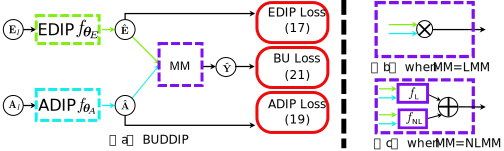

# BUDDIP: Hyperspectral Blind Unmixing using a Double Deep Image Prior
Official pytorch implementation of the paper "**[Hyperspectral Blind Unmixing using a Double
Deep Image Prior]()**" (TNNLS'2023).



# Citing
If this code is helpful to you, please cite:
## BibTex
```
@INPROCEEDINGS{
  
}

```